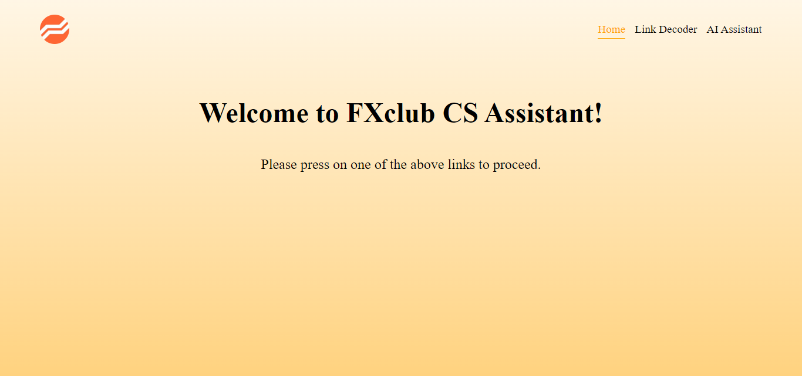
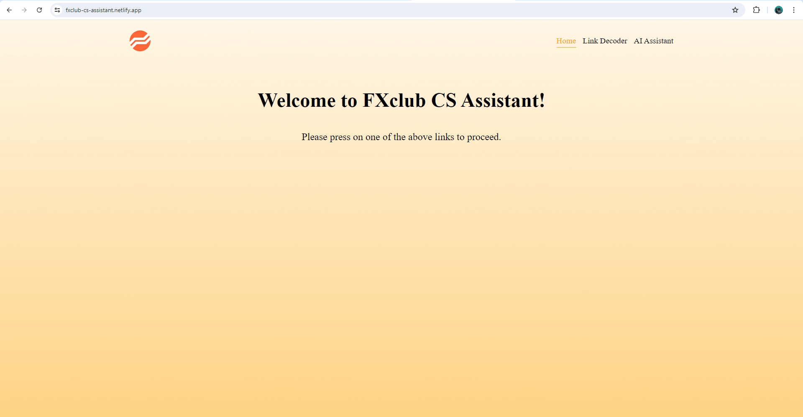
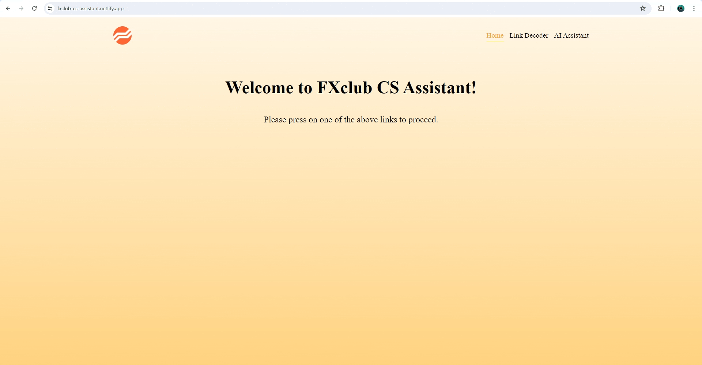

# FXclub CS Assistant

## Simplifying Customer Support for FXclub Agents

As a customer support agent, I created the FXclub CS Assistant to simplify my own workflow and help my colleagues deliver exceptional service with ease. My goal is to provide a set of efficient tools that minimize manual effort and maximize the quality of support we provide to our customers.

## Table of contents

- [Overview](#overview)
  - [Features](#features)
  - [Notes](#notes)
  - [Screenshot](#screenshot)
  - [How to use](#how-to-use)
  - [Links](#links)
- [My process](#my-process)
  - [Built with](#built-with)
- [Author](#author)

## Overview

### Features

Users should be able to:

- **Link Decoder**: A handy tool that decodes encoded links, removing unnecessary characters like %, ?, and more.
- **AI Assistant**: An AI-powered tool that helps agents write emails to customers in multiple languages, simplifying the process and reducing response times.

### Notes

- The website isn't responsive. The reason for that is that we work on laptops only so I didn't find a reason to make it responsive on mobile and other devices.
- The backend is hosted on a free render.com server which means that if you leave the chat for a while and then try to type a prompt, it may take about 30 seconds to respond, but after that it will be responding faster if you keep on using it actively during the day.

### Screenshot

### How to use

- **Link Decoder**: 
- **AI Assistant**: 

### Links

- [Github Repository](https://github.com/simokitkat/fxclub-cs-assistant)
- Live Site URL: [FXclub CS Assistant](https://fxclub-cs-assistant.netlify.app/)

## My process

### Built with

- [React](https://reactjs.org/) - JS library
- [React Router](https://reactrouter.com/)
- [Typescript](https://www.typescriptlang.org/)
- [Vite](https://vitejs.dev/)
- [SCSS](https://sass-lang.com/)
- [Node.js](https://nodejs.org/en/)

## Author

- [My Personal Website](https://islam-soliman.netlify.app/)
- [Linkedin](https://www.linkedin.com/in/islamsoliman92)
